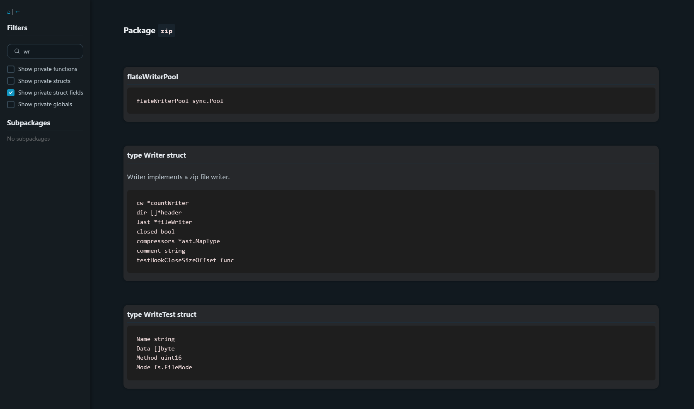

# Arrow

Arrow is a fast, modern documentation generator for Go.
It uses idiomatic concurrency, minimal dependencies, and clean HTML templates to create fully browsable, filterable documentation pages for Go codebases.

## Features

-  Very fast: Generates docs for the entire go standard library in 5 seconds
-  Dark mode UI with structured, collapsible sections
-  Live search to instantly find types, functions, or variables
-  Filter toggles for private/public symbols
-  Subpackage navigation
-  Doc comments included — like godoc
-  Single-page HTML output — no servers or dependencies

## Screenshot



## Installation

```bash
go install github.com/navid-m/arrow@latest
```

---

## Usage

To generate docs for your own project:

```bash
cd path/to/project/
arrow .
```

This creates a folder named "docs" of `.html` files (one per package), which one can open locally or serve statically (e.g. via GitHub Pages, `python3 -m http.server`, etc.).

## Performance

| Task                        | Time     |
| --------------------------- | -------- |
| Stdlib (150+ packages)      | \~5 sec  |
| Medium project (10–20 pkgs) | <1 sec   |
| Output size (HTML)          | \~1–30MB |

> Some packages like `sys/unix` may generate large HTML due to thousands of constants.

## Why Another Go Doc Tool?

Most Go documentation tools are either:

-  Slow (`godoc`, `golds`)
-  Clunky to run locally
-  Not ideal for static export or fast browsing

Arrow is different in that it is stateless, extremely fast, and modern both in design and UX.

It can be plugged into CI, hosted statically, or used offline as a personal reference.

## License

GPL v3 only.
